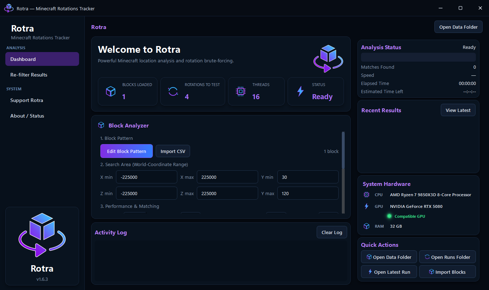
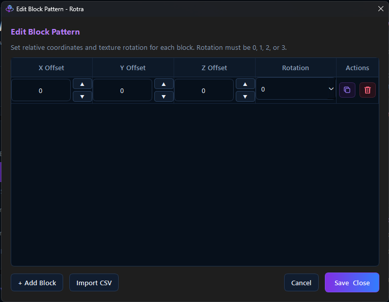
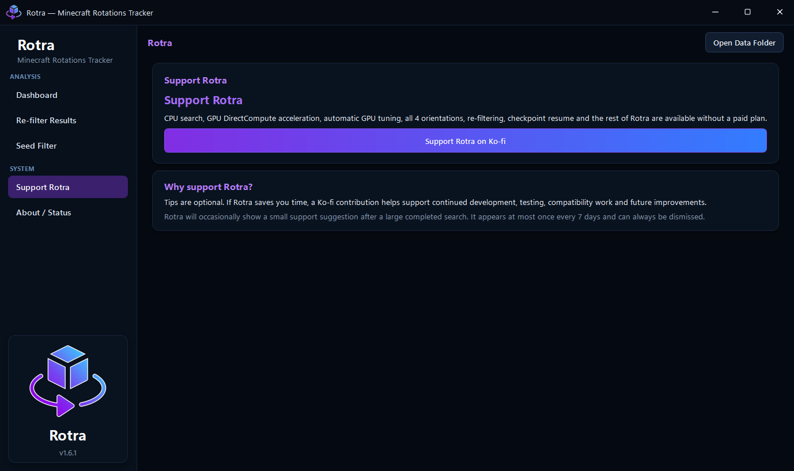

# Rotra

**Minecraft Rotations Tracker for Windows**

Rotra is a Windows desktop tool for finding Minecraft coordinates from block texture rotations.

It supports CPU and GPU-accelerated searching, all four horizontal orientations, re-filtering, checkpoint resume, run history, and a built-in Block Pattern Editor.

Developed by **Kovex**.

---

## How to Use

Watch Rotra in action and see the speed comparison:

---

## Download

Download the official Windows installer from the GitHub Releases section:

[**Download Rotra v1.6.3 →**](https://github.com/kovexdev/Rotra-Minecraft-Rotations-Tracker/releases/tag/v1.6.3)

Official release assets include:

- `Rotra_Setup.exe`
- `SHA256SUMS.txt`

Only download Rotra from the official Kovex GitHub repository.

---

## Latest Release

**Rotra v1.6.3**

See the full changelog and download the latest version from:
[GitHub Releases](https://github.com/kovexdev/Rotra-Minecraft-Rotations-Tracker/releases/tag/v1.6.3)

---

## Screenshots

### Dashboard

### Block Pattern Editor

### Support Rotra

---

## Features

- CPU coordinate search
- GPU-accelerated DirectCompute search
- Automatic GPU tuning
- All 4 horizontal orientations
- Block Pattern Editor
- Re-filter existing results
- Checkpoint resume
- Run history and saved results
- High result limits
- Automatic run folders
- Modern Windows interface

---

## Free to Use

Rotra is free to use.

There are no paid feature tiers and no account is required.

CPU search, GPU acceleration, automatic GPU tuning, re-filtering, checkpoint resume, and the rest of the application are available to everyone.

---

## Support Rotra

If Rotra saves you time and you want to support future development, you can support Kovex on Ko-fi.

[**Support Rotra on Ko-fi →**](https://ko-fi.com/kovex)

Tips are completely optional and do not unlock any additional features.

---

## System Requirements

- Windows 10 or Windows 11, 64-bit
- 64-bit x86 CPU
- DirectX 11-compatible GPU recommended for GPU acceleration

CPU mode is available as a fallback.

GPU compatibility and performance depend on your graphics card and driver.

---

## Security

Rotra performs its analysis locally on your computer.

Rotra is currently distributed without a paid Authenticode code-signing certificate, so Windows SmartScreen may display an **Unknown Publisher** warning.

Official releases are tested before publication and include a SHA-256 checksum.

---

## Privacy

Rotra does not require an account.

Most functionality runs locally on your computer.

See [PRIVACY.md](PRIVACY.md) for more information.

---

## License

Rotra is proprietary software.

You may download and use official copies of Rotra under the terms of the Rotra Proprietary License.

Unauthorized redistribution, resale, re-uploading, or presenting Rotra as your own software is prohibited except where applicable law provides otherwise.

See [LICENSE](LICENSE).

---

## Support

For bug reports, support, or security-related contact:

`devkovex@gmail.com`

---

## Disclaimer

Rotra is an independent project.

Minecraft is a trademark of Microsoft Corporation.

Rotra is not affiliated with, endorsed by, sponsored by, or associated with Microsoft or Mojang.

---

**Rotra © 2026 Kovex. All rights reserved.**
